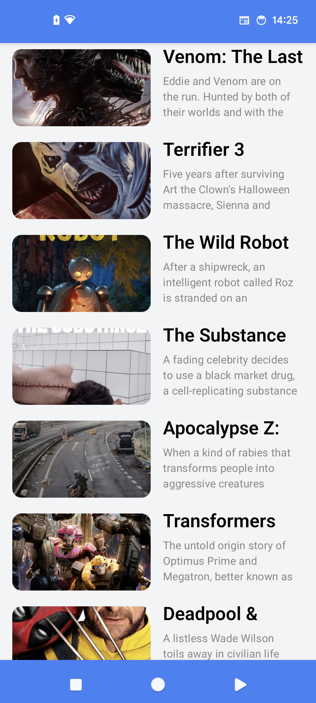
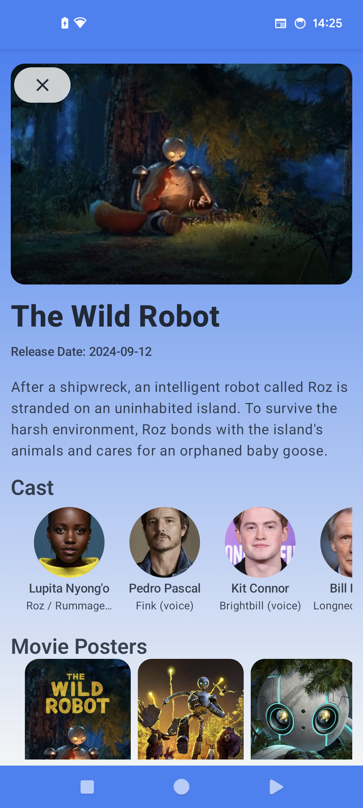
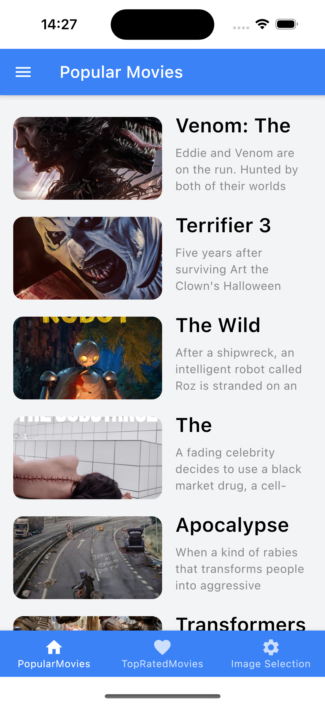
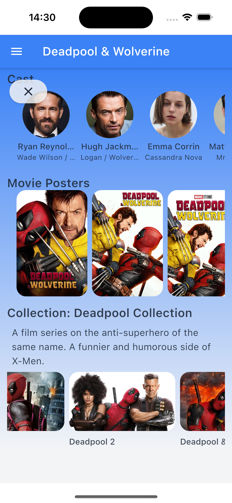

# MovieApp Compose Multiplatform

This repository contains the source code for the **MovieApp Compose Multiplatform** application. The app is built using Jetpack Compose Multiplatform to create a unified user interface for Android and iOS, delivering an interactive experience for browsing movie collections.

## Features

- **Cross-Platform Support**: This app works on both Android and iOS using Compose Multiplatform.
- **Movie Details**: Browse movies with detailed information like title, release date, overview, and more.
- **Collections**: View movie collections such as franchises like *Star Wars*, displaying multiple parts in an easy-to-navigate format.
- **LazyColumn Integration**: Efficient scrolling and data display using Compose's LazyColumn and LazyRow.

## Getting Started

To get started with this project, you need to have Android Studio or IntelliJ IDEA installed.

### Prerequisites

- [Android Studio](https://developer.android.com/studio) or [IntelliJ IDEA](https://www.jetbrains.com/idea/download/)
- Kotlin Multiplatform Mobile Plugin

### Setup Instructions

1. Clone this repository:
   ```sh
   git clone https://github.com/davidHarush/MovieApp-ComposeMultiplatform-.git
   ```

2. Open the project in Android Studio or IntelliJ IDEA.

3. Sync the project with Gradle and run the app on an emulator or device (Android or iOS).

### Running the App

- **Android**: Select an Android device or emulator, then click the run button.
- **iOS**: Use an iOS simulator or a connected device, select the iOS target, and run the app.

## Project Structure

- **commonMain**: Contains shared code, such as UI components, models, and business logic.
- **androidMain**: Android-specific implementations.
- **iosMain**: iOS-specific code and configurations.

## Technologies Used

- **Jetpack Compose**: For building UIs in a declarative manner.
- **Kotlin Multiplatform Mobile (KMM)**: To share code between Android and iOS.
- **Ktor**: For making network requests to fetch movie data.
- **Coil**: For loading images.

## Screenshots

### Android
<div style="display: flex; flex-wrap: wrap;">
  
  
</div>


### iOS
<div style="display: flex; flex-wrap: wrap;">
  
  
</div>

## Contributing

Feel free to contribute to this project by submitting pull requests. For major changes, please open an issue first to discuss what you would like to change.

### Contribution Steps

1. Fork the repository.
2. Create a new branch (`git checkout -b feature/YourFeatureName`).
3. Make your changes and commit them (`git commit -m 'Add some feature'`).
4. Push to the branch (`git push origin feature/YourFeatureName`).
5. Open a pull request.

---

Happy Coding! 🎥✨
